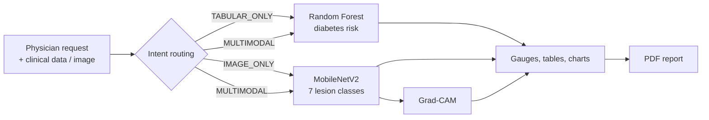

# MedRoute AI

**A multimodal AI platform for clinical decision support.**
MedRoute AI routes a physician's request to the right specialized machine-learning model: a Random Forest for diabetes risk from clinical data, a MobileNetV2 CNN for skin-lesion classification from images, or both. Results come with confidence levels, Grad-CAM explanations and a downloadable PDF report.


## Table of contents

1. [Features](#features)
2. [How it works](#how-it-works)
3. [Project structure](#project-structure)
4. [Datasets](#datasets)
5. [Models and results](#models-and-results)
6. [Installation](#installation)
7. [Running the project](#running-the-project)
8. [Using the platform](#using-the-platform)
9. [Configuration and model files](#configuration-and-model-files)
10. [Methodology notes](#methodology-notes)
11. [Limitations and ethics](#limitations-and-ethics)
12. [Troubleshooting](#troubleshooting)
13. [Roadmap](#roadmap)
14. [References](#references)
15. [Author](#author)


## Features

- **Three assistance paths**: `TABULAR_ONLY` (diabetes), `IMAGE_ONLY` (skin lesion), `MULTIMODAL` (both models run and results are shown together).
- **Natural-language request** or one-click exam selection from the home page.
- **Diabetes risk module**: 8 clinical inputs, probability gauge, risk level, and a parameter table comparing each value with a reference.
- **Skin-lesion module**: 7-class prediction with top-3 probabilities, a lesion-suspicion index, and a Grad-CAM heatmap beside the original image.
- **Explainability** with Grad-CAM on the last convolutional layer of MobileNetV2.
- **PDF clinical report** with parameters, results, the image and its heatmap, interpretation text and a legal disclaimer.
- **Safety by design**: no simulated outputs (the app shows an error if a model is missing), zero-value warnings for missing clinical data, and explicit limitation statements.

## How it works



1. The physician picks an exam card or types a request.
2. The intent (`TABULAR_ONLY`, `IMAGE_ONLY` or `MULTIMODAL`) selects which modules are displayed and run.
3. Clinical values go to the Random Forest, which returns a probability; the image is resized to 224 × 224, scaled to [0, 1] and sent to MobileNetV2, which returns 7 class probabilities.
4. Grad-CAM is computed on the same image and model.
5. The interface shows the results and can export them as a PDF.

**About the router.** The intent classifier is a small custom Transformer encoder trained in `notebooks/05_transformer.ipynb` (tokenizer, embedding, multi-head self-attention, feed-forward block, softmax over 3 intents). In the current Streamlit demo, typed requests are routed by a lightweight keyword function (`route_prompt` in `app.py`), and the three exam cards allow manual selection. Connecting the saved Transformer to the app is listed in the [roadmap](#roadmap).

## Project structure

The relative paths used in the code are `../data/...` and `../models/...`, so the layout below is expected. Adjust it if your folders differ.

```
MedRoute_AI/
├── app/
│   ├── app.py                    # Streamlit interface (home, results, Grad-CAM, PDF)
│   ├── backend_orchestrator.py   # Loads the trained models (RF + CNN)
│   ├── router.py                 # Intent classification helper (Transformer)
│   ├── clean.py                  # Input / image preprocessing helpers
│   ├── evaluate.py               # Accuracy, classification report, confusion matrix
│   └── .streamlit/config.toml    # Optional light theme
├── data/
│   └── raw/
│       ├── diabetes/diabetes.csv
│       └── melanoma/
│           ├── HAM10000_metadata.csv
│           ├── HAM10000_images_part_1/
│           └── HAM10000_images_part_2/
├── models/                       # Trained models (.pkl, .h5)
├── notebooks/
│   ├── 01_diabetes_eda.ipynb
│   ├── 02_diabetes_random_forest.ipynb
│   ├── 03_melanoma_eda.ipynb
│   ├── 04_melanoma_cnn.ipynb
│   ├── 05_transformer.ipynb
│   ├── 06_explainability.ipynb
│   └── melanoma_cnn_colab.ipynb  # CNN training on Colab (GPU)
├── reports/                      # Figures and evaluation outputs
└── README.md
```

## Datasets

| Dataset | Task | Content |
|---|---|---|
| **Pima Indians Diabetes** | Binary classification (diabetes risk) | 768 patients, 8 clinical features, 268 diabetic (35%) |
| **HAM10000** | 7-class skin-lesion classification | 10,015 dermoscopic images: `akiec`, `bcc`, `bkl`, `df`, `mel`, `nv`, `vasc` |
| **Router prompts** | 3-class intent classification | Hand-written physician-style requests (about 20 sentences) |

Both public datasets are **imbalanced**: about 65% of Pima patients are non-diabetic, and about 67% of HAM10000 images are benign melanocytic nevi (`nv`).

Download them from their original sources and place them under `data/raw/` as shown above. The datasets are not included in this repository. Please respect their licenses and terms of use.

**Pima features (input order matters):** `Pregnancies`, `Glucose`, `BloodPressure`, `SkinThickness`, `Insulin`, `BMI`, `DiabetesPedigreeFunction`, `Age`.

## Models and results

### 1. Diabetes: Random Forest

- **Preprocessing:** impossible zeros in glucose, blood pressure, skin thickness, insulin and BMI are treated as missing and replaced by the median; stratified 80/20 split (`random_state=42`); SMOTE on the training set only.
- **Tuning:** `RandomizedSearchCV` (20 iterations, 5-fold cross-validation, F1 scoring) over the number of trees, depth, split and leaf sizes, bootstrap and class weights.
- **Results on 154 test patients:**

| Metric | Value |
|---|---|
| Accuracy | 75.3% |
| Macro F1 | 0.73 |
| Recall (diabetic) | 0.69 |

| | Predicted non-diabetic | Predicted diabetic |
|---|---|---|
| **Actual non-diabetic** | 79 | 21 |
| **Actual diabetic** | 17 | 37 |

The 17 missed diabetic patients (false negatives) are the clinically costliest error.

### 2. Skin lesions: MobileNetV2 (transfer learning)

- **Input:** 224 × 224 × 3, pixel values rescaled to [0, 1].
- **Architecture:** MobileNetV2 (ImageNet weights, no top) → global average pooling → Dense 128 (ReLU) → Dropout 0.5 → Dense 7 (softmax).
- **Training:** frozen backbone first, then progressive fine-tuning (last 30 layers, then last 60 layers) with a low learning rate; Adam, categorical cross-entropy, balanced class weights; data augmentation (rotation, shifts, shear, zoom, horizontal and vertical flips) on the training set only.
- **Evaluation:** 20% stratified hold-out (1,870 images).

| Class | Precision | Recall | F1 | Support |
|---|---|---|---|---|
| akiec | 0.49 | 0.43 | 0.46 | 61 |
| bcc | 0.63 | 0.50 | 0.56 | 98 |
| bkl | 0.52 | 0.41 | 0.45 | 202 |
| df | 0.00 | 0.00 | 0.00 | 22 |
| mel | 0.57 | 0.29 | 0.38 | 209 |
| nv | 0.82 | 0.96 | 0.89 | 1252 |
| vasc | 1.00 | 0.19 | 0.32 | 26 |
| **Accuracy** | | | **0.76** | 1870 |
| **Macro avg** | 0.58 | 0.40 | 0.44 | 1870 |
| **Weighted avg** | 0.73 | 0.76 | 0.73 | 1870 |

Always predicting `nv` would already give about 67% accuracy, so macro F1 and per-class recall are the meaningful metrics here. Melanoma recall (0.29) is a clear weakness (see [Limitations](#limitations-and-ethics)).

### 3. Intent router: custom Transformer encoder

Tokenizer (vocabulary 1,000, 20 tokens) → Embedding (64) → multi-head self-attention (2 heads) with residual + LayerNorm → feed-forward block with residual + LayerNorm → global average pooling → Dropout → Dense 32 → softmax over `TABULAR_ONLY`, `IMAGE_ONLY`, `MULTIMODAL`. It is trained on a small hand-written prompt set, so it is a proof of concept rather than a benchmarked component.

### 4. Explainability: Grad-CAM

Grad-CAM uses the last convolutional layer of MobileNetV2 (`out_relu`, 7 × 7 × 1280): gradients of the predicted class score are averaged per channel, used to weight the feature maps, passed through a ReLU, resized to the image and blended with the original (jet colormap). It is a coarse guide to *where the network looked*, not clinical proof.

## Installation

**Requirements:** Python 3.10 or newer (check the TensorFlow documentation for the Python versions your TensorFlow release supports), and a standard computer. A GPU is optional and only useful for training.

```bash
git clone <your-repository-url>
cd MedRoute_AI

python -m venv .venv
# Linux / macOS
source .venv/bin/activate
# Windows
.venv\Scripts\activate

pip install --upgrade pip
pip install streamlit plotly numpy pandas pillow opencv-python tensorflow \
            scikit-learn imbalanced-learn joblib fpdf2 matplotlib seaborn jupyter
```

Optional, only for the Hugging Face experiment in `05_transformer.ipynb`:

```bash
pip install transformers datasets torch
```

> The PDF code relies on the **`fpdf2`** package (not the old `fpdf`). Install it with `pip install fpdf2`.

You can freeze your exact environment afterwards with `pip freeze > requirements.txt`.

## Running the project

### 1. Train or reproduce the models (notebooks)

Run the notebooks in order from the `notebooks/` folder:

| Order | Notebook | Purpose |
|---|---|---|
| 1 | `01_diabetes_eda.ipynb` | Diabetes EDA, cleaning, baseline Random Forest, saved to `models/` |
| 2 | `02_diabetes_random_forest.ipynb` | SMOTE and hyperparameter search, optimized model |
| 3 | `03_melanoma_eda.ipynb` | HAM10000 exploration and class distribution |
| 4 | `04_melanoma_cnn.ipynb` | Baseline CNN, transfer learning, fine-tuning, evaluation |
| 5 | `05_transformer.ipynb` | Intent router training and orchestration test |
| 6 | `06_explainability.ipynb` | Grad-CAM functions and examples |

`melanoma_cnn_colab.ipynb` is the version used for GPU training on Google Colab.

### 2. Launch the platform

The backend loads models from `../models`, a path relative to the **current working directory**, so start Streamlit from the `app/` folder:

```bash
cd app
streamlit run app.py
```

Then open the local URL shown in the terminal (usually `http://localhost:8501`).


## Using the platform

1. **Choose an exam**: click *Risque de diabète*, *Lésion cutanée* or *Bilan global*, or type a request in natural language (for example, "Évaluer le risque diabétique et analyser cette lésion").
2. **Diabetes module**: enter the 8 clinical values. The app shows the risk level, the model probability, a gauge, and a table comparing each value with a reference. The *Référence* column shows the average split threshold learned by the Random Forest for each feature; the *Lecture* badge uses conventional clinical cut-offs. Zero values trigger a warning because they represent missing data in the training set.
3. **Skin-lesion module**: upload a JPG or PNG image and click *Lancer l'analyse de la lésion*. The app shows the most likely lesion class, the model certainty, a **suspicion index** (sum of the probabilities of `mel`, `bcc` and `akiec`), the top-3 probabilities, and the Grad-CAM heatmap.
4. **Synthesis**: in a global exam, a summary box combines both results at the top.
5. **PDF report**: click *Préparer le compte-rendu PDF*, then download it. The report contains consultation info, parameters, results, the image with its Grad-CAM map, interpretation and the disclaimer.

Risk and suspicion levels use fixed display thresholds (green below 40%, orange from 40% to 75%, red above 75%). They are chosen for readability and are **not** calibrated clinical thresholds.

## Configuration and model files

`backend_orchestrator.py` loads two files at import time, from `MODEL_DIR = "../models"`:

| Variable | Default file | Role |
|---|---|---|
| `rf_model` | `diabetes_random_forest.pkl` | Diabetes Random Forest (joblib) |
| `melanoma_model` | `medroute_melanoma_model.h5` | MobileNetV2 skin-lesion classifier (Keras) |

The `models/` folder may contain other versions (for example `diabetes_random_forest_optimized.pkl` and several `.h5` checkpoints or backups). **Make sure the files loaded by the backend are the ones that produced the results you report.** To switch models, edit the two filenames in `backend_orchestrator.py`.